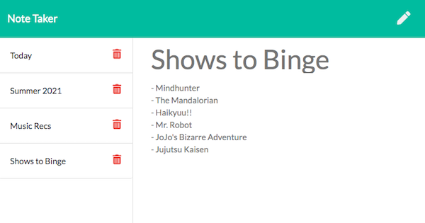

[](https://github.com/maphaiyarath/note-taker)
# Express: Note Taker



You can see the deployed app [here](https://maphaiyarath-note-taker.herokuapp.com/).

## Table of Contents
* [Description](#description)
* [Installation](#installation)
* [Usage](#usage)
* [Credits](#credits)
* [License](#license)
* [Contributing](#contributing)

## Description
This application can be used to write, save, and delete notes. It uses an Express backend and saves and retrieves note data from a JSON file.

## Installation
Use the following command for installation:
```bash
npm install
```

## Usage
The application will be invoked by running:
```bash
node server.js
```
You can open your browser and view the app at [localhost:8080](localhost:8080).

## Credits
* [Express.js](http://expressjs.com/)

## License
This project is licensed under the MIT license.

## Contributing
n/a
